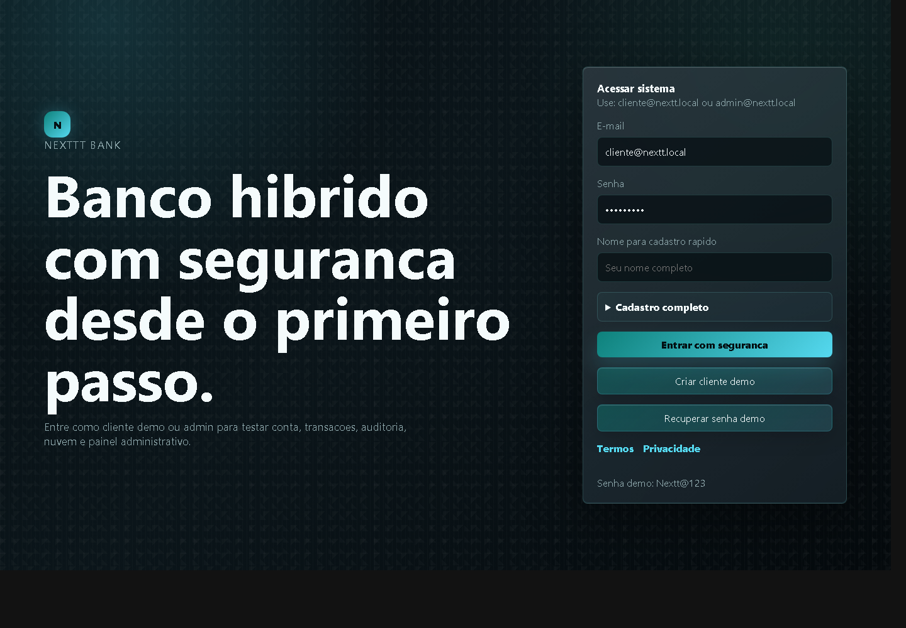
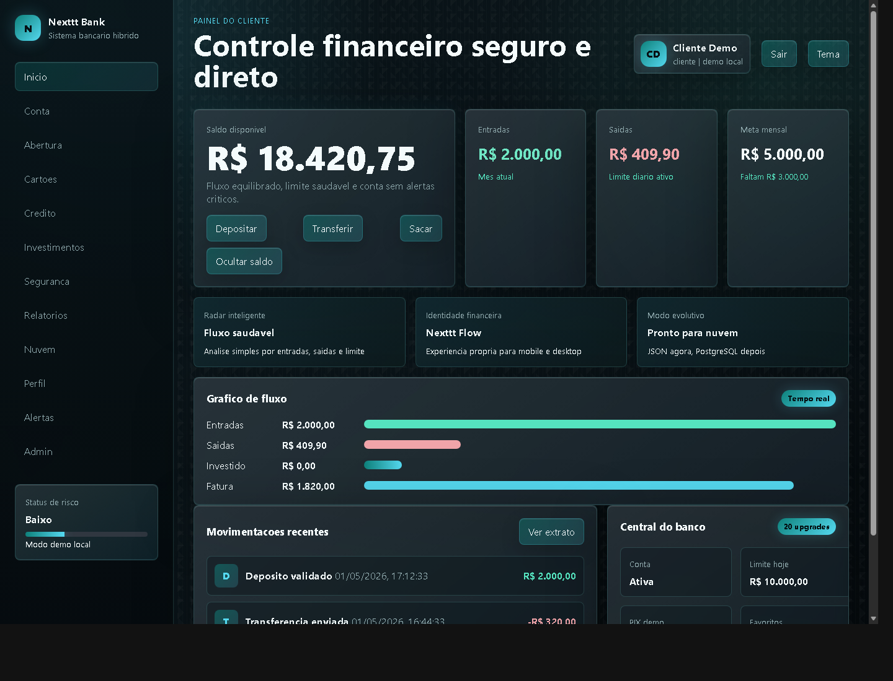
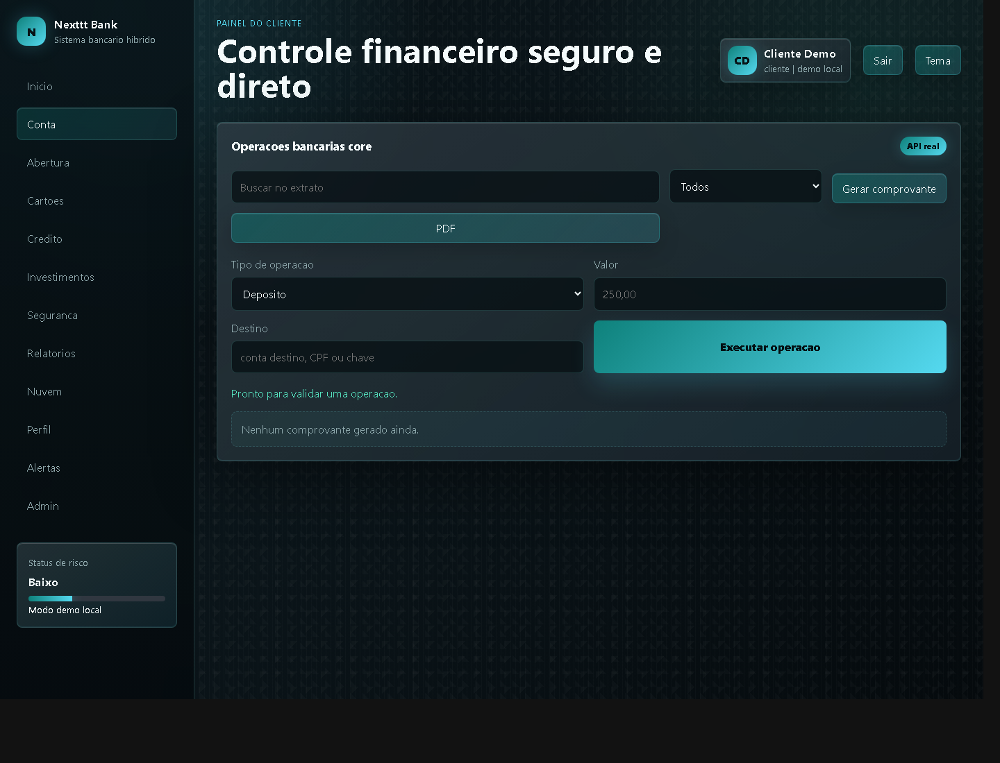
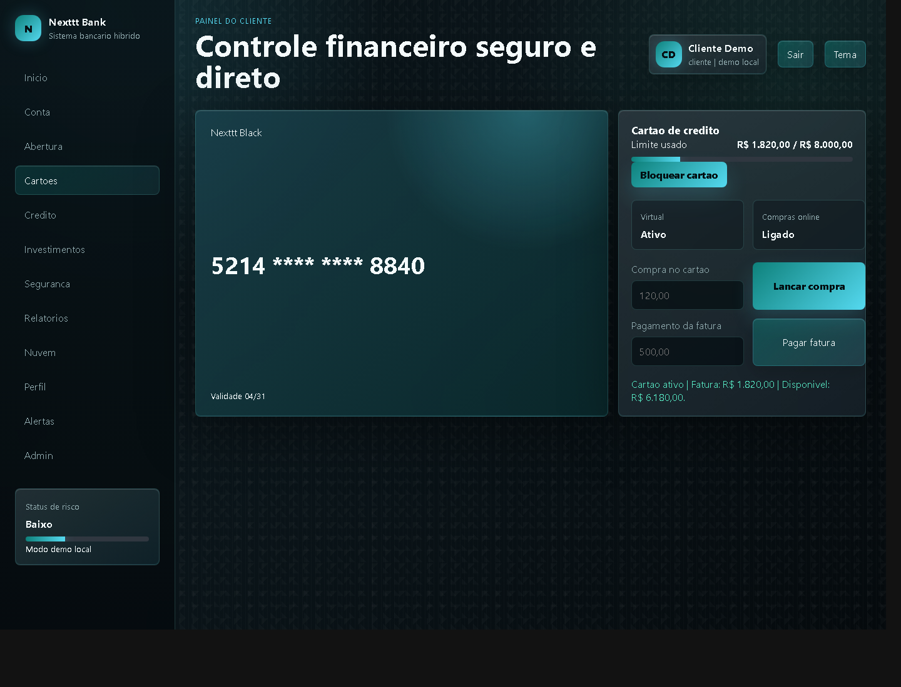
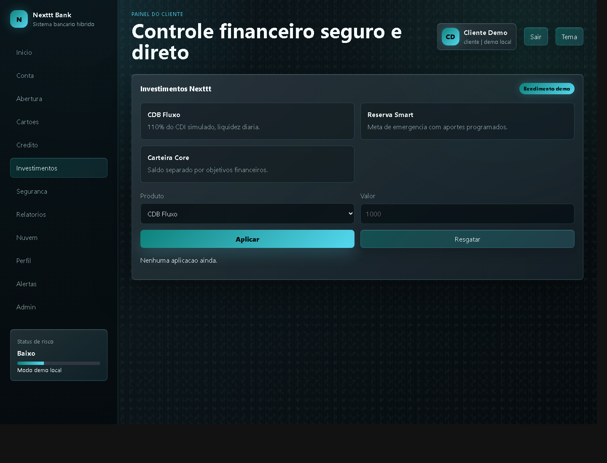
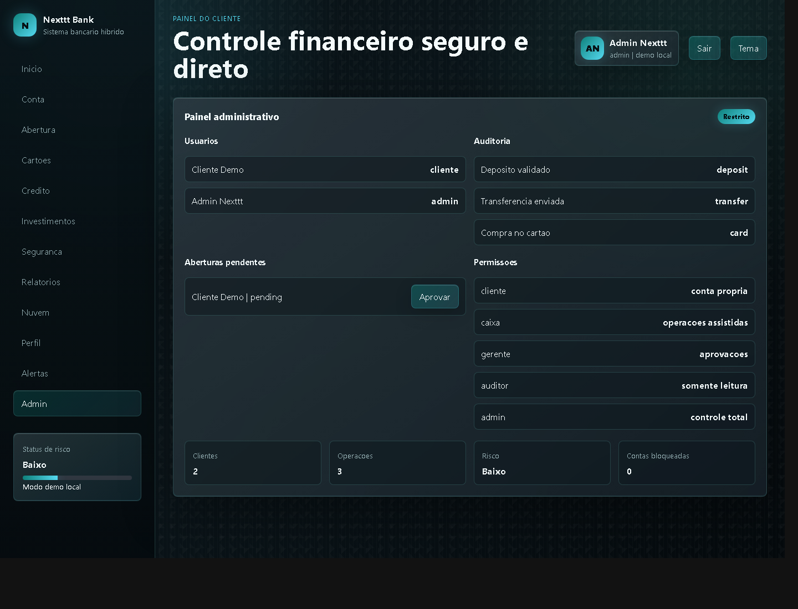
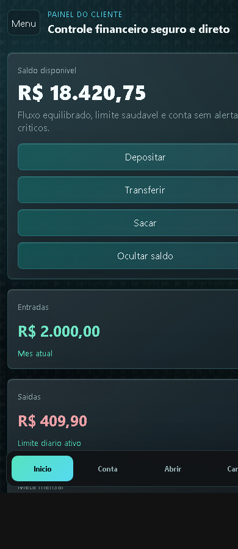

# Nexttt Bank - Sistema Bancario Web


Projeto de portfolio desenvolvido por **Widinei Martins de Oliveira**: um sistema bancario web com interface premium, operacoes financeiras simuladas, autenticacao, painel administrativo, relatorios, auditoria e estrutura preparada para evoluir para nuvem.

> Este projeto e demonstrativo/educacional. Ele simula fluxos bancarios para portfolio e entrevistas, sem conexao com instituicao financeira real.

## Aviso importante para usar em outro computador

O arquivo local `data/nextt-db.json` **nao e enviado para o GitHub** porque pode conter sessoes, tokens temporarios, logs e dados gerados durante testes locais.

Para abrir o projeto em outro notebook ou PC, use a base demo segura que esta no repositorio:

```bash
git clone https://github.com/Widineii/Nextt-bank.git
cd Nextt-bank
mkdir data
copy database\nextt-db.demo.json data\nextt-db.json
npm start
```

No Linux/macOS:

```bash
mkdir -p data
cp database/nextt-db.demo.json data/nextt-db.json
npm start
```

## Demonstracao

### Login



### Dashboard desktop



### Operacoes bancarias



### Cartoes



### Investimentos



### Painel administrativo



### Mobile



## Funcionalidades

- Login com usuario demo e fallback local para apresentacao
- Cadastro de cliente demo com validacao basica
- Dashboard com saldo, entradas, saidas, meta mensal e grafico de fluxo
- Deposito, saque, transferencia e PIX simulado
- Historico de transacoes com filtros
- Cartao com limite, fatura, compra, bloqueio e pagamento
- Investimentos com aplicacao, rendimento demonstrativo e resgate
- Emprestimos com simulacao de parcelas e solicitacao
- Abertura de conta com fluxo KYC demonstrativo
- Painel administrativo com usuarios, auditoria e aprovacoes
- Relatorios em CSV e comprovante PDF via backend
- Layout responsivo para celular, notebook e desktop
- Modo de demonstracao por arquivo local, sem servidor
- Estrutura preparada para Docker, PostgreSQL e deploy em nuvem

## Tecnologias

- HTML5, CSS3 e JavaScript
- Node.js com servidor HTTP nativo
- JSON local como persistencia demonstrativa
- PostgreSQL preparado via schema/migrations em `docs/`
- Docker e Docker Compose
- GitHub Actions
- PWA com manifest e service worker versionado

## Como rodar

### Deploy no Vercel

O projeto esta pronto para publicar no Vercel como vitrine web em modo demo.

Guia rapido: [DEPLOY_VERCEL.md](DEPLOY_VERCEL.md)

### Deploy no Netlify

Tambem esta pronto para publicar no Netlify como vitrine web em modo demo.

Guia rapido: [DEPLOY_NETLIFY.md](DEPLOY_NETLIFY.md)

### Modo mais simples para portfolio

Abra o arquivo:

```text
NEXTTT_BANK_NAVEGADOR.html
```

Ou use o atalho no Windows:

```text
CLIQUE_AQUI_PARA_ABRIR_NEXTTT_BANK.bat
```

Esse modo abre a interface diretamente no navegador, sem depender de servidor local.

### Modo com API local

```bash
npm start
```

Depois acesse:

```text
http://localhost:3000/?v=12
```

Login demo:

```text
cliente@nextt.local
admin@nextt.local
Senha: Nextt@123
```

## Scripts

```bash
npm start          # inicia o servidor local
npm test           # roda testes estruturais
npm run test:api   # roda smoke test de API
npm run test:e2e   # valida preparacao para E2E
npm run backup     # gera backup dos dados locais
npm run docker     # sobe ambiente com Docker Compose
```

## Estrutura do projeto

```text
.
|-- public/              # Interface web, PWA, CSS e JavaScript
|-- src/                 # Servidor Node.js, config, logger e persistencia
|-- src/db/              # Adaptadores JSON e PostgreSQL preparado
|-- docs/                # Arquitetura, deploy, seguranca, schema e migrations
|-- database/            # Banco JSON demo higienizado para portfolio
|-- images/              # Screenshots usados no README
|-- scripts/             # Backup, reset demo e captura de prints
|-- tests/               # Testes estruturais e smoke test
|-- .github/workflows/   # CI do GitHub Actions
|-- Dockerfile
|-- docker-compose.yml
`-- README.md
```

## Qualidade e seguranca

- Hash de senha com PBKDF2 no backend
- Controle de sessao e expiracao
- Rate limit simples por IP/rota
- Headers de seguranca HTTP
- Auditoria de operacoes administrativas
- Separacao entre interface, servidor, configuracao e camada de dados
- Dados sensiveis reais nao sao usados no projeto

## Banco de Dados Demo

O repositorio inclui uma base demonstrativa em:

```text
database/nextt-db.demo.json
```

Ela foi higienizada para portfolio: tokens de sessao, recuperacoes de senha e logs locais nao sao versionados. Para usar essa base localmente, copie o arquivo para `data/nextt-db.json` antes de iniciar o servidor.

## Como apresentar em entrevista

1. Abra pelo modo navegador e mostre o login demo.
2. Apresente o dashboard financeiro e os graficos.
3. Demonstre deposito, saque, transferencia ou PIX simulado.
4. Mostre cartoes, investimentos e emprestimos.
5. Finalize no painel administrativo, explicando auditoria, relatorios e preparo para API/deploy.

## Melhorias futuras

- Conectar PostgreSQL em producao
- Implementar JWT ou cookies seguros com HTTPS publico
- Adicionar testes E2E completos com Playwright
- Criar API REST documentada com OpenAPI/Swagger
- Integrar envio real de e-mail/SMS para recuperacao de senha
- Adicionar cobertura de testes
- Evoluir backend publico em Render, Railway ou VPS

## Autor

**Widinei Martins de Oliveira**

- GitHub: [github.com/Widineii](https://github.com/Widineii)
- LinkedIn: [linkedin.com/in/widineimartinsdev](https://www.linkedin.com/in/widineimartinsdev)
- WhatsApp: [w.app/widineii](https://w.app/widineii)
